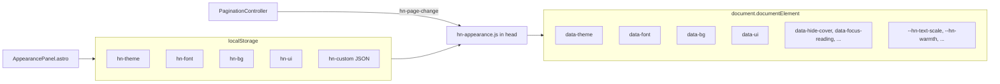

# Hand Notes — Full Agent Handoff Context

> Updated handoff after the **appearance & reading-focus system** (2026-05-17). Read this end-to-end before touching any file.

---

## 1. Project Identity

- **Name:** Hand Notes — a static Astro v5 site for engineering notes
- **Repo:** `/home/tawrat/engineering-notes`
- **Live:** https://hand-notes.netlify.app
- **Aesthetic:** warm paper notebook — graph-paper code blocks, handwritten fonts, paginated page cards. **Readability is the top priority on every decision.**

### Commands

```bash
npm install
npm run dev      # http://localhost:4321
npm run build    # → dist/
```

---

## 2. File Tree & Routes

```
/
├── .gitignore                   # ignores: .agents/, skills-lock.json, .astro/, dist/, node_modules/
├── README.md                    # developer guide
├── CLAUDE.md                    # AI agent rules — READ THIS FIRST
├── AGENT-HANDOFF.md             # this file
├── netlify.toml
├── astro.config.mjs             # output:'static', site:'https://hand-notes.netlify.app'
├── package.json                 # astro@^5.7.0
├── public/
│   ├── favicon.svg
│   └── hn-appearance.js         # shared appearance prefs (FOUC + panel) — DO NOT REMOVE
└── src/
    ├── styles/
    │   ├── tokens.css           # CSS custom properties + --hn-* user-adjustable tokens
    │   ├── themes.css           # [data-theme] [data-font] [data-ui] overrides
    │   ├── appearance.css       # backgrounds, contrast mix, reading-focus modes
    │   ├── components.css       # every component class + .hn-panel* + responsive
    │   └── global.css           # resets, @imports (tokens → themes → appearance → components)
    ├── layouts/
    │   └── BaseLayout.astro     # HTML shell, Google Fonts, hn-appearance.js FOUC
    ├── components/
    │   ├── SiteNav.astro
    │   ├── AppearancePanel.astro  # 🎨 floating settings (replaced ThemeFontPanel.astro)
    │   └── PaginationController.astro
    └── pages/
        ├── index.astro                  # notes listing (hardcoded array)
        ├── style-guide.astro            # design system + Appearance section
        └── notes/
            ├── spring-boot-ioc.astro       # 10 pages
            ├── database-acid.astro         # 10 pages
            └── spring-transactional.astro  # 12 pages
```

| Route | File |
|---|---|
| `/` | `index.astro` |
| `/notes/spring-boot-ioc/` | `notes/spring-boot-ioc.astro` |
| `/notes/database-acid/` | `notes/database-acid.astro` |
| `/notes/spring-transactional/` | `notes/spring-transactional.astro` |
| `/style-guide/` | `style-guide.astro` |

---

## 3. Session History (most recent first)

### Session 4 — appearance expansion + reading focus (uncommitted as of handoff)

User asked for more eye-soothing themes, reading-friendly customizations, and UX features (e.g. hide cover while reading).

#### What was built

**14 color themes** (grouped in panel as Classic / Calm & refreshing / Soft dark):

| Group | ID | Panel label | Intent |
|---|---|---|---|
| Classic | `warm` | ☀️ Warm | Default notebook |
| Classic | `cool` | ❄️ Cool | Cool blue paper |
| Classic | `sepia` | 📜 Sepia | Low glare, strong ink/paper separation |
| Classic | `sage` | 🌿 Sage | Calm green tint |
| Classic | `cream` | 🤍 Cream | Soft ivory, minimal strain |
| Classic | `contrast` | 🔲 Contrast | High-contrast light (accessibility) |
| Calm | `lavender` | 💜 Lavender | Soft purple, calming |
| Calm | `ocean` | 🌊 Ocean | Cool aqua, refreshing |
| Calm | `rose` | 🌸 Rose | Warm blush |
| Calm | `mint` | 🍃 Mint | Fresh green |
| Soft dark | `dark` | 🌙 Dark | Original warm dark |
| Soft dark | `dusk` | 🌆 Dusk | Soft twilight (not harsh) |
| Soft dark | `midnight` | 🌃 Midnight | Deep navy restful dark |
| Soft dark | `oled` | ⬛ OLED | True black for OLED screens |

**6 fonts** (`data-font`): `klee` (default) · `caveat` · `patrick` · `kalam` · `legible` (Atkinson Hyperlegible) · `clear` (Nunito Sans). Mono is always JetBrains Mono.

**4 backgrounds** (`data-bg`): `lined` (default) · `plain` · `dots` · `minimal`

**3 UI feels** (`data-ui`): `soft` · `default` · `crisp`

**Reading-focus toggles** (in `hn-custom` JSON):
- `hideCover` — always hides `.content-wrap > .cover`
- `autoHideCover` — hides cover when paginated past page 1 (via `hn-page-change` event)
- `hideDecor` — hides `.cover-doodle`, `.section-num`, `.cover-tags`
- `focusReading` — narrower column (760px), softer card shadows, no sticky rotation

**Sliders** (in `hn-custom`):
- `contrast` (0–100) — ink/paper color-mix
- `bgOpacity` (0–100) — body/page line intensity
- `textScale` (90–115%, floored to body ≥15px, code ≥13.5px)
- `lineHeight` (90–110%)
- `warmth` (0–100) — blue-light / cozy overlay on `body::before`
- `letterSpacing` (0–100) — up to 0.06em on body text

**Column width** (`contentWidth`): `narrow` (760px) · `default` (920px) · `wide` (960px) via `html[data-content-width]`

**One-tap presets** (`HNAppearance.applyReadingPreset`):
- `eyeease` — lavender + legible + minimal + focus + auto-hide cover + hide decor
- `comfort` — sepia + legible + plain + soft UI + narrow
- `night` — dusk + clear + plain + warmth + auto-hide + hide decor
- `default` — resets to `DEFAULTS`
- `compact` — smaller text, crisp UI (still available in JS, not shown as separate panel chip in latest panel — only eyeease/comfort/night/default buttons)

#### Theme panel UI preference (important)

User **rejected** color-swatch grid theme picker. **Keep theme section as icon + label pill buttons** in `.hn-panel-row` (e.g. `☀️ Warm`, `💜 Lavender`). This is the only place emoji in the **UI chrome** is acceptable — not in note content.

Floating toggle: **🎨** when closed, **✕** when open (same as original `ThemeFontPanel`).

#### Files created/changed

| File | Role |
|---|---|
| `public/hn-appearance.js` | `loadFromStorage`, `savePrefs`, `applyAppearancePrefs`, `parseCustom`, `applyReadingPreset`, `resetPrefs` |
| `src/components/AppearancePanel.astro` | Full settings UI (replaces deleted `ThemeFontPanel.astro`) |
| `src/styles/appearance.css` | Reading modes, warmth overlay, content-width, dark theme ink-display |
| `src/styles/themes.css` | All 14 themes + fonts + `data-ui` |
| `src/styles/tokens.css` | `--text-body`, `--hn-*` scale tokens |
| `src/styles/global.css` | Imports `appearance.css`; body lines use `--hn-bg-opacity` |
| `src/styles/components.css` | `.body-text`/`.code-block` use text tokens; `.hn-panel*` styles; dark overrides for `dusk`/`midnight` |
| `src/layouts/BaseLayout.astro` | `AppearancePanel`, Google Fonts (+ Atkinson, Nunito), FOUC via `/hn-appearance.js` |
| `src/components/PaginationController.astro` | Dispatches `hn-page-change` on every page nav (for auto-hide cover) |
| `README.md`, `CLAUDE.md`, `style-guide.astro` | Documented appearance system |

---

### Session 3 — initial appearance system (same day, earlier)

First implementation of token-driven appearance: 7 themes, 6 fonts, backgrounds, sliders, `AppearancePanel` with swatch grid (later reverted to pills per Session 4).

---

### Session 2 — commit `5d00070 — replace emoji with sketch-like text symbols across all notes`

Replaced all colorful/decorative emoji across all three note files with sketch-like Unicode text symbols. These inherit CSS text color and render like hand-drawn pen marks — consistent across all themes.

#### The sketch-like symbol palette (use this for any new **note content**)

| Symbol | Meaning / Used for |
|---|---|
| `★` | concept, definition, key insight, mental model, "Remember" |
| `✎` | notes, cheat sheet, interview Q&A, "Next to Study" |
| `⚡` | deep dive, internals, crash recovery, critical path |
| `↺` | lifecycle, propagation, cycles, MVCC |
| `◎` | isolation, focus/zoom, resolution, decision guide |
| `✓` | correct, valid, success, "With X" comparison labels |
| `✗` | error, bug, violation, "Without X" comparison labels |
| `≡` | overview, all attributes, stack layers, summary |
| `?` | question stickies |
| `!` | warning, caution, common bug source |
| `→` | dependency injection direction |
| `◷` | timeout / time-bounded operations |
| `◉` | database / record symbol (cover doodle in database-acid) |

**Emoji exception:** Appearance panel theme buttons use emoji icons (☀️ ❄️ etc.) by explicit user preference. Do **not** replace those with sketch symbols unless the user asks.

#### Special exception — Page 2 of `database-acid.astro`

The Atomicity bank-transfer ASCII prose-in-`<pre>` blocks contain `💥`, `🔥`, `✅`. **Do not touch.** User reverted changes twice.

---

### Session 1 — commit `4c6bbb2 — feat: design fixed`

Rule #6 enforcement + `.note-table` paper-card system on `database-acid.astro`. See git history for page-by-page conversion table.

#### `.note-table` CSS design (do not undo)

- Opaque cell backgrounds (`--paper` / `--paper2`)
- Outer `box-shadow` ring (not `border` — fights `border-collapse` + `border-radius`)
- Token-based colors (works on all themes)
- Column dividers via adjacent `border-left`
- Mobile: `display: block; overflow-x: auto` at ≤640px

#### Anomaly table convention (Pages 4–5)

```html
<table class="note-table">
  <thead>
    <tr><th style="width:60px">Time</th><th>Transaction A</th><th>Transaction B</th></tr>
  </thead>
  <tbody>
    <tr><td><strong>T1</strong></td><td><code>BEGIN</code></td><td></td></tr>
  </tbody>
</table>
```

---

## 4. Appearance System (critical for agents)

### Architecture



### localStorage keys

| Key | Values / shape |
|---|---|
| `hn-theme` | One of 14 theme IDs (validated in JS; unknown → `warm`) |
| `hn-font` | `klee` · `caveat` · `patrick` · `kalam` · `legible` · `clear` |
| `hn-bg` | `lined` · `plain` · `dots` · `minimal` |
| `hn-ui` | `soft` · `default` · `crisp` |
| `hn-custom` | JSON object (see below) |

### `hn-custom` JSON schema

```json
{
  "contrast": 0,
  "bgOpacity": 100,
  "textScale": 100,
  "lineHeight": 100,
  "pageRules": true,
  "codeGrid": true,
  "hideCover": false,
  "autoHideCover": false,
  "hideDecor": false,
  "focusReading": false,
  "warmth": 0,
  "letterSpacing": 0,
  "contentWidth": "default"
}
```

### FOUC prevention (do not break)

In `BaseLayout.astro` `<head>`:

```html
<script is:inline src="/hn-appearance.js"></script>
<script is:inline>
  if (window.HNAppearance) window.HNAppearance.loadFromStorage();
</script>
```

`hn-appearance.js` must use `is:inline` on the script tag (Astro build requirement for public assets).

### Reading-mode CSS hooks (`appearance.css`)

| `html` attribute | Effect |
|---|---|
| `data-hide-cover="on"` | Hide `.content-wrap > .cover` |
| `data-auto-hide-cover="on"` + `data-auto-hide-cover-active="on"` | Hide cover after page 1 |
| `data-hide-decor="on"` | Hide doodles, tags, `.section-num` |
| `data-focus-reading="on"` | Narrow width, calmer shadows |
| `data-content-width="narrow\|wide"` | 760px / 960px `--content-width` |
| `data-page-rules="off"` | No ruled lines on `.page::after` |
| `data-code-grid="off"` | No graph grid on `.code-block` |

Dark themes for component overrides: `dark`, `oled`, `dusk`, `midnight` (sticky labels, code comments, etc.).

### Pagination integration

`PaginationController.astro` dispatches on every page change:

```javascript
document.documentElement.dispatchEvent(
  new CustomEvent('hn-page-change', { detail: { index: current, total: total } })
);
```

`hn-appearance.js` listens and sets `data-auto-hide-cover-active="on"` when `index > 0` and `autoHideCover` is enabled.

---

## 5. Non-Negotiable Rules (from `CLAUDE.md`)

1. **Read-friendly design always wins** — body scales via `--text-body` (default 18px, min 15px); code via `--text-code` (default 13.5px min); content width 920px default.
2. **Always use `<pre>` for code blocks** — Astro minifier collapses newlines inside `<div>` siblings.
3. **Escape `{` → `&#123;` and `}` → `&#125;`** in `.astro` HTML sections.
4. **Check `/style-guide`** before inventing styles.
5. **CSS Grid children need `min-width: 0`**.
6. **No ASCII art in `<pre class="code-block">`** — use real components (`.note-table`, `.phase-flow`, etc.).
7. **Mobile-first** — breakpoints 768 / 640 / 480px; `.page-num` hidden ≤640px; swipe guard in pagination.
8. **Cover `h1` is one sentence, no `<br />`**.
9. **Sketch symbols in note content** — not colorful emoji (appearance panel theme icons excepted).

---

## 6. CSS Architecture

```
global.css
  @import tokens.css        ← :root + --hn-* user tokens, --text-body/--text-code
  @import themes.css        ← [data-theme] [data-font] [data-ui]
  @import appearance.css    ← contrast mix, backgrounds, reading modes, warmth overlay
  @import components.css    ← components + .hn-panel* + responsive
```

### Key tokens (`tokens.css`)

- Paper/ink: `--paper`, `--ink`, `--body-bg`, accents, shadows
- User scale: `--hn-text-scale`, `--hn-line-scale`, `--hn-bg-opacity`, `--hn-warmth`, `--hn-letter-spacing`
- Derived: `--text-body`, `--text-body-leading`, `--text-code`, `--text-code-leading`
- Layout: `--content-width` (overridden by `data-content-width`)

---

## 7. Component Reference

(Same as before — see `CLAUDE.md` cheat sheet. Highlights:)

- `.body-text` uses `var(--text-body)` and `var(--text-body-leading)`
- `.code-block` uses `var(--text-code)`; grid opacity from `--code-grid-opacity`
- `.note-table` — opaque paper card for timelines and reference data
- Appearance: `AppearancePanel.astro` + `.hn-panel*` classes in `components.css`

---

## 8. Pagination System (`PaginationController.astro`)

- Paginates `.page` inside `.content-wrap`; `.cover` stays in DOM (may be hidden via appearance prefs).
- `body.pg-mode` — extra bottom padding for nav bar.
- Swipe guard `isInsideHScrollable` — **never remove**.
- URL hash `#page-N`; dispatches `hn-page-change` for appearance auto-hide cover.
- Theme panel offset when `body.pg-mode`: toggle `bottom: 84px` (desktop), `70px` (mobile).

---

## 9. Adding a New Note (Checklist)

1. Copy `spring-boot-ioc.astro` template.
2. Escape `{` / `}` in HTML section.
3. `<pre class="code-block">` for all code.
4. Use `.note-table` / `.phase-flow` etc. — no ASCII in `<pre>`.
5. Sketch symbols for icons/labels (not emoji).
6. Cover `h1` single sentence; tags text-only.
7. `<PaginationController />` before `</BaseLayout>`.
8. Register in `index.astro` `notes` array.

---

## 10. Current Notes in `src/pages/index.astro`

```javascript
const notes = [
  { href: '/notes/spring-transactional/', pages: 12, ... },
  { href: '/notes/database-acid/',         pages: 10, ... },
  { href: '/notes/spring-boot-ioc/',       pages: 10, ... },
];
```

---

## 11. User Preferences (Observed)

- **Readability first** — appearance work focused on eye-soothing themes, sliders, hide-cover, focus mode.
- **Theme picker style** — icon + label pills (☀️ Warm), **not** color swatch grids.
- **Compact, minimal changes** — don't refactor unrelated code.
- **Commit messages:** short, lowercase, imperative.
- **Tables need visible column dividers.**
- **One job per component** — don't duplicate content in prose + diagram.
- **database-acid Page 2 atomicity ASCII** — do not touch.
- **Sketch symbols in notes**; emoji OK only in appearance panel theme buttons and 🎨 toggle.
- **Handwritten + legible fonts** — user wanted `legible` (Atkinson) and `clear` (Nunito) alongside handwriting options.
- **Advanced customization OK** — sliders for contrast, warmth, letter spacing, reading presets.

---

## 12. Possible Next Steps

- Commit appearance system changes (may be uncommitted — run `git status` first).
- `prefers-color-scheme: dark` auto-theme (was explicitly out of scope).
- Export/import appearance presets.
- New note topics (Spring AOP, JVM memory, B+ Tree indexing).
- Content collections for `notes` array.
- `@astrojs/sitemap` + RSS.
- Audit remaining ASCII in `<pre>` across notes (Rule #6).
- Update `style-guide.astro` Appearance section with all 14 themes if incomplete.

---

## 13. Files to Read First (in order)

1. **`CLAUDE.md`** — rules + appearance system summary.
2. **`public/hn-appearance.js`** — source of truth for prefs API and presets.
3. **`src/components/AppearancePanel.astro`** — UI wiring.
4. **`src/styles/appearance.css`** + **`themes.css`** — visual behavior.
5. **`/style-guide`** — component demos.
6. **`src/pages/notes/database-acid.astro`** — `.note-table` + sketch symbols reference.

---

## 14. Quick "Don't Break These" List

- ✗ Don't remove `/hn-appearance.js` or FOUC scripts in `BaseLayout.astro`.
- ✗ Don't remove `isInsideHScrollable` in `PaginationController.astro`.
- ✗ Don't remove `hn-page-change` dispatch (breaks auto-hide cover).
- ✗ Don't change theme panel back to swatch grid — user wants icon + label pills.
- ✗ Don't draw ASCII tables in `<pre>` — use `.note-table`.
- ✗ Don't make `.note-table` cells transparent.
- ✗ Don't touch database-acid Page 2 atomicity ASCII blocks.
- ✗ Don't add colorful emoji to note content (section icons, stickies, etc.).
- ✗ Don't use `<div>` for code blocks — use `<pre>`.
- ✗ Don't forget `{` / `}` escaping in `.astro` templates.
- ✗ Don't shrink body text below 15px or code below 13.5px (enforced in `hn-appearance.js`).
- ✗ Don't use bare grid children without `min-width: 0`.
- ✗ Don't put `<br />` in cover `h1`.
